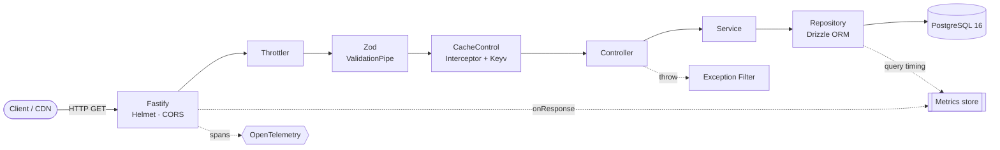
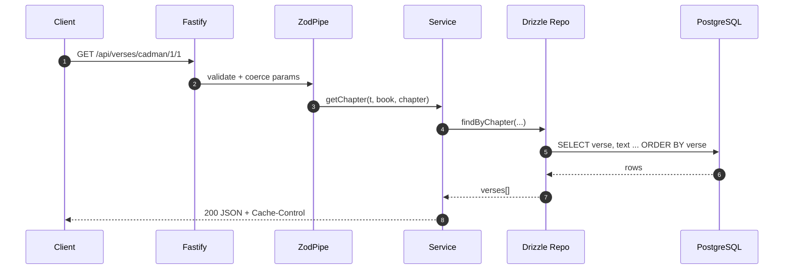
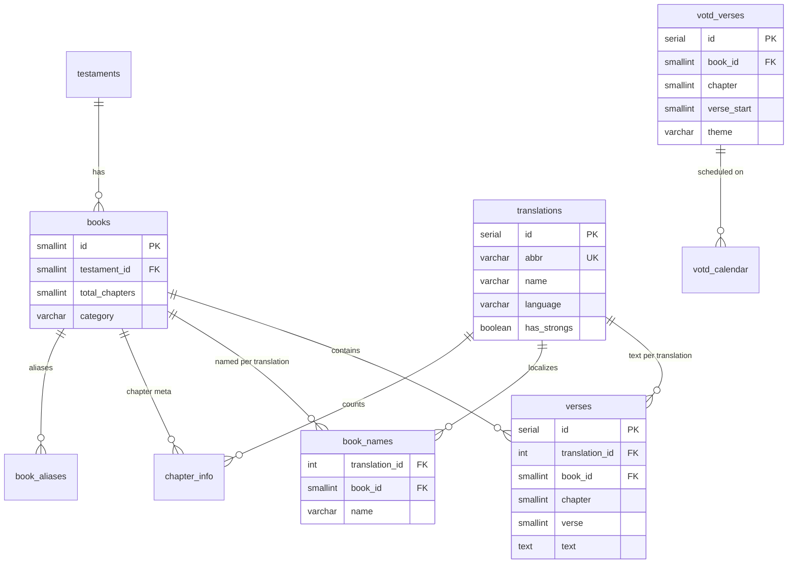

<div align="center">

# 📖 Bible API

**REST API phục vụ dữ liệu Kinh Thánh** — đa bản dịch, tên sách song ngữ (Anh/Việt),
tìm kiếm toàn văn (PostgreSQL FTS), và *Verse of the Day*.

[](https://github.com/splatpublisher84-tech/bible-api/actions/workflows/ci.yml)
[](https://bible-api-ibsnxg.fly.dev)


[](https://skillicons.dev)

[**🌐 Live**](https://bible-api-ibsnxg.fly.dev) · [**📚 API Docs**](https://bible-api-ibsnxg.fly.dev/api-docs) · [**📊 Dashboard**](https://bible-api-ibsnxg.fly.dev/dashboard) · [**🖥️ Demo**](https://bible-api-ibsnxg.fly.dev/demo)

</div>

---

## ✨ Tính năng

| | |
|---|---|
| 🌍 **Đa bản dịch** | 1 bảng `verses` cho mọi bản dịch (Cadman 🇻🇳 · KJV Strong's 🇬🇧, ~62k câu) |
| 🔎 **Full-text search** | PostgreSQL GIN + `to_tsvector('simple')` |
| 📅 **Verse of the Day** | Tất định theo ngày (calendar + hash fallback) |
| ⚡ **Cache 2 tầng** | HTTP `Cache-Control` + server-side Keyv |
| 📈 **Observability** | Dashboard in-memory metrics + OpenTelemetry (env-gated) |
| 🛡️ **Bảo mật** | Helmet · CORS (GET-only) · Rate-limit · Zod validation |

## 🏗️ Kiến trúc



<details>
<summary><b>Vòng đời 1 request (sequence)</b></summary>



</details>

## 🚀 Quick Start

> Yêu cầu: **Node ≥ 24**, **Docker**. Setup máy mới chỉ 4 lệnh:

```bash
cp .env.example .env
npm ci
npm run db:reset      # Postgres sạch → drizzle-kit migrate → seed ~62k câu
npm run dev           # http://localhost:3000
```

Mở [localhost:3000](http://localhost:3000) → [API Docs](http://localhost:3000/api-docs) · [Dashboard](http://localhost:3000/dashboard) · [Demo](http://localhost:3000/demo)

```bash
# Thử nhanh
curl localhost:3000/api/verses/cadman/1/1/1            # Sáng thế ký 1:1 🇻🇳
curl localhost:3000/api/verses/kjv_strongs/43/3/16     # John 3:16 🇬🇧
curl 'localhost:3000/api/search?q=love&translation=kjv_strongs&limit=5'
```

## 🔌 API Endpoints

| Method | Endpoint | Mô tả |
|:---:|---|---|
| `GET` | `/api/translations` | Danh sách bản dịch |
| `GET` | `/api/translations/:abbr` | 1 bản dịch |
| `GET` | `/api/books?translation=` | 66 sách |
| `GET` | `/api/books/:bookId/chapters?translation=` | Chương + số câu |
| `GET` | `/api/verses/:translation/:book/:chapter` | Cả chương |
| `GET` | `/api/verses/:translation/:book/:chapter/:verse` | 1 câu |
| `GET` | `/api/search?q=&translation=&limit=&offset=` | Tìm toàn văn |
| `GET` | `/api/votd?date=&translation=` | Verse of the Day |
| `GET` | `/api/status` · `/api/metrics?key=` | Health + số liệu |
| `GET` | `/health` · `/api-docs` · `/dashboard` · `/demo` | Infra + UI |

## 🗄️ Database Schema



> Schema do **`src/database/schema.ts`** làm chủ → `drizzle-kit generate` sinh migration trong `drizzle/`.

## 📁 Cấu trúc dự án

```
src/
├─ main.ts                 # Bootstrap Fastify: helmet, CORS, static, swagger, OTel, metrics hook
├─ app.module.ts           # Root: Config, Logger(pino), Throttler, Cache(Keyv), Database
├─ app.setup.ts            # configureApp() — prefix /api, ZodPipe, exception filter (dùng chung test)
├─ tracing.ts              # OpenTelemetry SDK (init trước bootstrap)
├─ database/               # schema.ts (Drizzle) · database.module.ts (pool + query metrics)
├─ common/                 # AllExceptionsFilter · CacheControl decorator + interceptor
├─ metrics/                # in-memory tracker + /api/metrics
├─ views/                  # /demo (CSP nonce) · /dashboard
└─ modules/<resource>/     # repository + service + dto (Zod) + controller
   └─ translations · books · verses(+search) · votd · status
drizzle/                   # migrations (nguồn: schema.ts)  ·  sql/seed.sql (data)
tests/                     # e2e (Nest + SWC)
```

## 📜 Scripts

| Script | Việc |
|---|---|
| `npm run dev` | Dev, auto-reload (`nest start --watch`) |
| `npm run build` / `npm start` | Compile TS → `dist/` / chạy `node dist/main` |
| `npm test` | E2E + integration (Vitest, cần DB) |
| `npm run typecheck` · `npm run check` | `tsc --noEmit` · Biome lint+format |
| `npm run db:reset` | Dựng lại DB: migrate + seed |
| `npm run db:migrate` · `npm run db:seed` | Áp schema · nạp data |

## ⚙️ Environment

| Biến | Mặc định | Mô tả |
|---|---|---|
| `PORT` | `3000` | Cổng server |
| `NODE_ENV` | `development` | môi trường |
| `DB_HOST/PORT/USER/PASSWORD/NAME` | — | PostgreSQL |
| `ALLOWED_ORIGINS` | `*` | CORS (phân tách bằng `,`) |
| `METRICS_KEY` | — | Bảo vệ `/api/metrics` |
| `LOG_LEVEL` | `info` | pino level |
| `OTEL_ENABLED` / `OTEL_EXPORTER_OTLP_ENDPOINT` | — | Bật OpenTelemetry |

## 🧰 Tech Stack

**Runtime** NestJS 11 · Fastify · TypeScript (strict) — **Data** Drizzle ORM · PostgreSQL 16 · nestjs-zod
**Cross-cutting** @nestjs/cache-manager (Keyv) · @nestjs/throttler · nestjs-pino · @nestjs/swagger · @fastify/helmet
**Observability** OpenTelemetry · in-memory metrics dashboard — **Tooling** Biome · Vitest + SWC · Husky · Docker · GitHub Actions

## 🚢 Deployment

Fly.io (`bible-api-ibsnxg`, iad, shared-cpu-1x 256MB) + Supabase PostgreSQL. Deploy: `flyctl deploy` (Docker multi-stage build TS → `node dist/main`).

> ⚠️ **Prod đã có sẵn schema/data** → **đừng** chạy `drizzle-kit migrate` mù (migration `0000_init` sẽ đụng bảng đã tồn tại). Cần *baseline* migration `0000` một lần trước khi migrate các bản sau.

---

<div align="center">
<sub>Refactor 2026: Express + JS + pg → <b>NestJS + TypeScript + Drizzle</b>, giữ 100% API contract.</sub>
</div>
