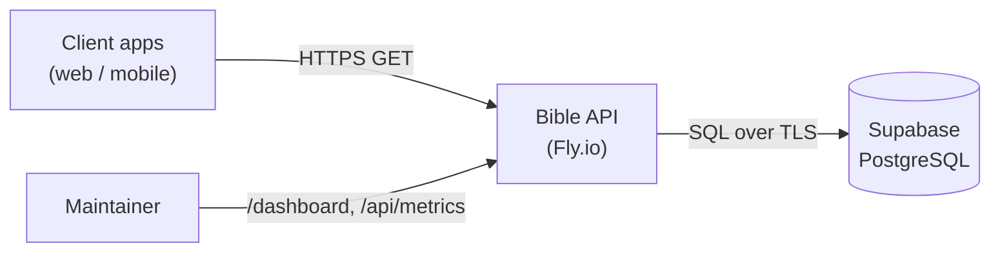
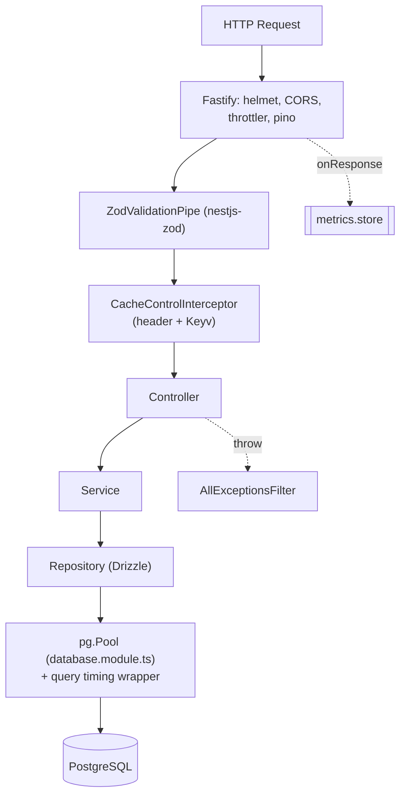
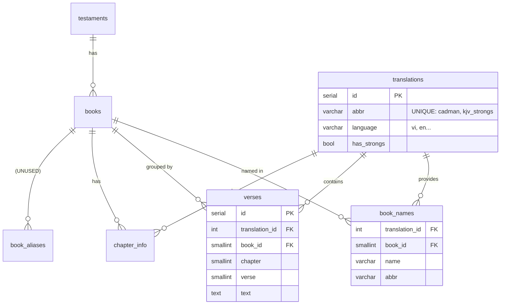

# Kiến trúc — Bible API

Tài liệu kiến trúc, viết theo phong cách C4 (từ tổng quan → chi tiết).
Mọi facts suy ra từ code thật (`src/`, `src/database/schema.ts`, `fly.toml`).

## 1. Context — hệ thống nói chuyện với ai

- API **chỉ đọc** (GET); không có endpoint write/admin.
- Dữ liệu chỉ thay đổi qua SQL migration / script import, không qua API.

## 2. Container — bên trong app

| Tầng | Vị trí | Trách nhiệm |
|---|---|---|
| Bootstrap | `src/main.ts` | Fastify + helmet/CORS/static/swagger/OTel/metrics hook |
| Setup dùng chung | `src/app.setup.ts` | prefix `/api`, ZodValidationPipe, exception filter |
| Root module | `src/app.module.ts` | Config, Logger(pino), Throttler, Cache(Keyv), Database |
| Controller | `src/modules/<res>/*.controller.ts` | route + DTO, gọi service |
| Service | `src/modules/<res>/*.service.ts` | logic, format `{ data }`, ném HttpException |
| Repository | `src/modules/<res>/*.repository.ts` | query Drizzle (inject `DRIZZLE`) |
| Database | `src/database/` | schema.ts (Drizzle) + database.module.ts (pool + timing) |
| Monitoring | `src/metrics/` + `src/views/` + `src/public/js/dashboard.js` | metrics in-memory + dashboard |

**Luồng lỗi:** service `throw NotFoundException(...)` → `AllExceptionsFilter` → `{ error }` / `{ error, details }` đúng HTTP status.
**Theo dõi DB:** `database.module.ts` bọc `pool.query` đo thời gian → `metrics.store.trackQuery`.
**OTel:** `src/tracing.ts` (env-gated) auto-instrument http + pg.

## 3. Data model

Nguyên tắc: **1 bảng `verses` cho mọi bản dịch** (phân biệt bằng `translation_id`).

**Ghi chú quan trọng (đã verify từ `src/database/schema.ts`):**
- `books` **KHÔNG** chứa tên sách — chỉ `testament_id`, `total_chapters`, `category`. Tên nằm ở `book_names` (theo từng bản dịch).
- Full-text search: GIN index trên **biểu thức** `to_tsvector('simple', text)` — **không có cột `text_search_vector`**. Config `simple` không stemming → tìm tiếng Việt có dấu kém.
- `chapter_info` = metadata pre-computed (số câu mỗi chương) cho tốc độ.
- `book_aliases` (parse "Gen/Gn/Genesis") tồn tại trong schema nhưng **không endpoint nào dùng** → code chết.
- `votd_verses` + `votd_calendar` (đều khai báo trong `schema.ts`). `votd_calendar` **rỗng** → VOTD chọn theo hash. Schema do **drizzle-kit** quản lý (`drizzle/` migrations); data ở `sql/seed.sql`.

## 4. Quyết định thiết kế (xem chi tiết ở `docs/adr/`)

- **NestJS 11 + Fastify + TypeScript + Drizzle** (refactor 2026 từ Express+JS+pg — ADR 0006).
- 1 bảng `verses` cho mọi bản dịch (thay vì tách bảng — ADR 0001).
- Cache: HTTP header **+ server-side Keyv** (date-scoped) sau refactor (ADR 0002).
- Metrics in-memory (không dùng dịch vụ monitoring ngoài — ADR 0003).
- VOTD chọn theo hash ngày (deterministic) khi calendar rỗng (ADR 0004).
- Supabase SSL `rejectUnauthorized: false` (self-signed cert — ADR 0005).

> Phần *tại sao* của các quyết định trên sẽ được ghi trong ADR — đó là phần
> kiến thức dễ mất nhất khi bàn giao.
